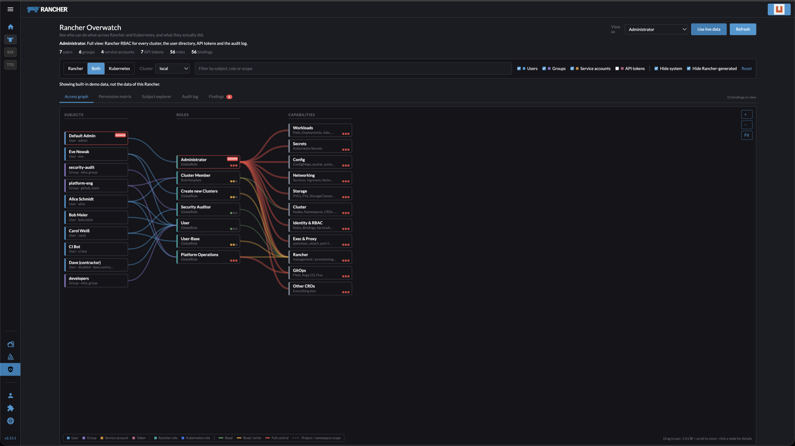
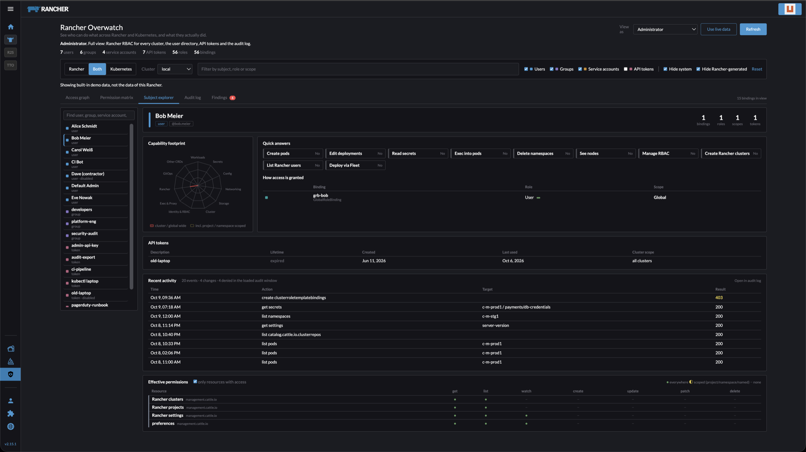
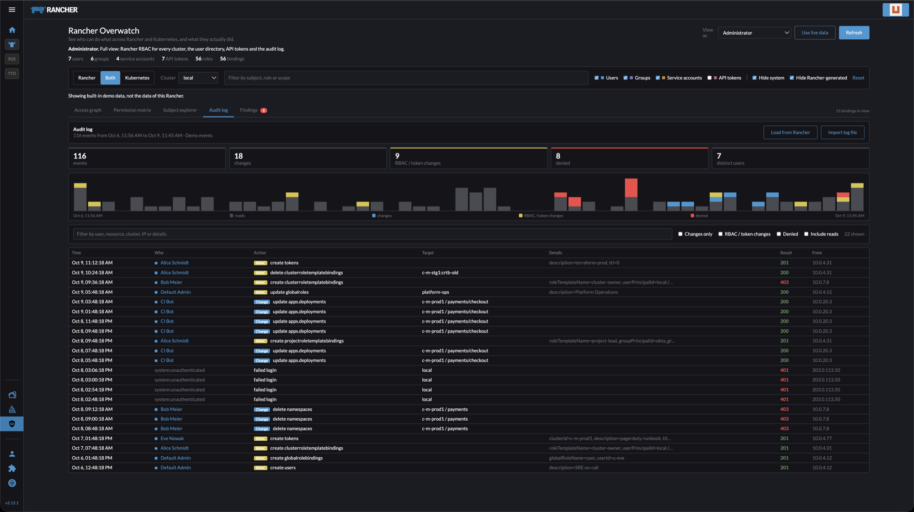
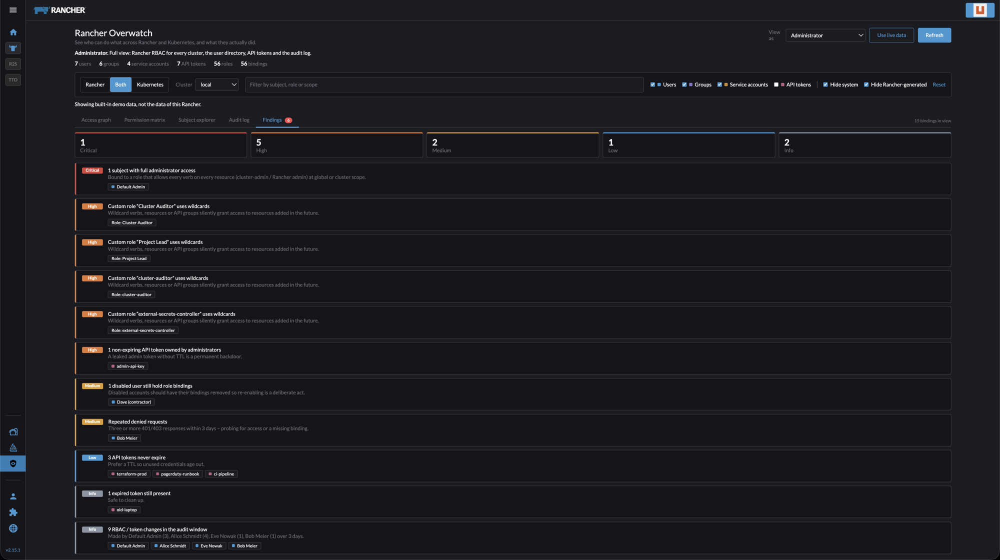
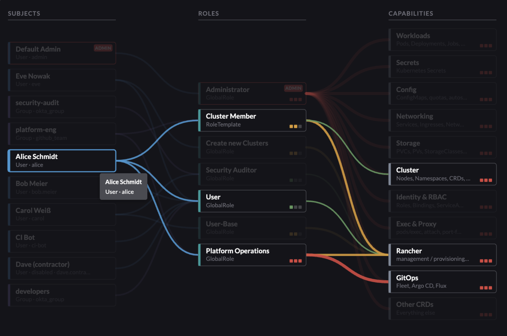

<p align="center">
  
</p>

# Rancher Overwatch

A [Rancher UI extension](https://extensions.rancher.io/) that shows **who can do what** across Rancher and Kubernetes RBAC, **and what they actually did**.



*Access graph in Rancher v2.15.1 (dark theme, built-in demo data): subjects → roles → capabilities.*

## What it does

| View | What you get |
|---|---|
| **Access graph** | Flow diagram of API tokens → users, groups and service accounts → Rancher and Kubernetes roles → capability areas (Workloads, Secrets, Networking, Exec, RBAC, …). Hover or click any node to trace its full path; dashed lines mean access limited to a project or namespace. |
| **Permission matrix** | Heatmap of every subject against every capability area. Filled = cluster/global wide, dashed = only inside a project or namespace. |
| **Subject explorer** | One user, group, service account or token: capability radar, quick answers ("can they exec into pods?"), every binding that grants access, API tokens, recent audit activity, and a resource × verb grid of effective permissions. |
| **Audit log** | Rancher API audit events (and Kubernetes audit logs) as a timeline and searchable table, with RBAC and token changes and denied requests highlighted. Admins only. |
| **Findings** | Automatic review: full administrators, wildcard roles, non-admins who can read Secrets or exec cluster-wide, escalation verbs, non-expiring tokens, disabled users that still have bindings, repeated denied requests, dormant admins. |

Both RBAC layers are covered: Rancher (global roles, role templates, cluster and project role bindings, API tokens) and the Kubernetes RBAC objects Rancher generates in each cluster (ClusterRoles, Roles, bindings, aggregated roles). Rancher-generated Kubernetes bindings can be hidden so they do not duplicate the Rancher layer.

## Who sees what

Data is read with the **signed-in user's own Rancher session**, so Rancher's API only returns what that user is entitled to. On top of that the UI adapts:

| | Administrator | Cluster owner | Project owner |
|---|---|---|---|
| Menu entry | yes | yes | yes |
| Role bindings | all clusters and projects | their cluster and its projects | their project |
| User directory, API tokens, global roles | yes | no | no |
| Kubernetes RBAC | every cluster | their cluster | – |
| Audit log tab | yes | hidden | hidden |

Accounts that cannot read any role binding do not get the menu entry at all. Details: [docs/access-model.md](docs/access-model.md).

## Screenshots

### Subject explorer


### Audit log


### Findings


### Tracing one subject through the graph


All screenshots use the built-in demo data (see below).

## Requirements

- Rancher **2.15** or newer (UI Extensions API v3, `@rancher/shell` 3.x)
- Node.js 20+ and Yarn 1.x to build

## Install

In Rancher 2.15+, add this repository as an extension repository and install from **Extensions**:

- **Extensions → ⋮ → Manage Repositories → Create**
- Git Repo URL `https://github.com/aeltai/rancher-overwatch.git`, Git Branch `gh-pages`
- **Extensions → Available → Rancher Overwatch → Install**

Full steps, a `kubectl` alternative, updating and uninstalling: [docs/installation.md](docs/installation.md).

## Quick start (development)

```bash
yarn install
API=https://<your-rancher> yarn dev      # serves the dashboard on https://localhost:8005
```

Log in, open the menu (☰) and choose **Rancher Overwatch** under *Global Apps*. Use **Show demo data** in the page header to explore without real data; the **View as** switch then previews what an administrator, a cluster owner or a project owner would see.

## Build

```bash
yarn build-pkg            # → dist-pkg/rancher-overwatch-0.1.0/
yarn test                 # logic checks for the RBAC engine
```

Releases are published to the `gh-pages` branch by the Release workflow when a GitHub release tagged `rancher-overwatch-<version>` is created; see [Releasing a new version](docs/installation.md#releasing-a-new-version-maintainers).

## Status

Version 0.1.0. Checked so far:

- the logic (permission resolution, graph, access gating, audit parsing) with automated checks and demo data,
- the UI in a Rancher v2.15.1 dev dashboard with the demo data, as an administrator, in the dark theme.

Not verified yet: live data on real installations, real non-administrator logins (cluster and project owners), loading audit events from a Helm-installed Rancher's `rancher-audit-log` sidecar, and the light theme. Known limits: group membership of individual users is not available from Rancher and is therefore not resolved; Kubernetes RBAC is read from one cluster at a time (or each cluster on demand with *All clusters*).

## Documentation

- [Installation](docs/installation.md): add the extension repository to Rancher, install, update, release
- [Access model](docs/access-model.md): who sees what and how it is enforced
- [Audit log](docs/audit-log.md): data sources, enabling audit logging, event handling
- [Architecture](docs/architecture.md): data flow, model, code layout
- [Development](docs/development.md): dev loop, tests, build, gotchas

## License

Apache License 2.0, see [LICENSE](LICENSE).
